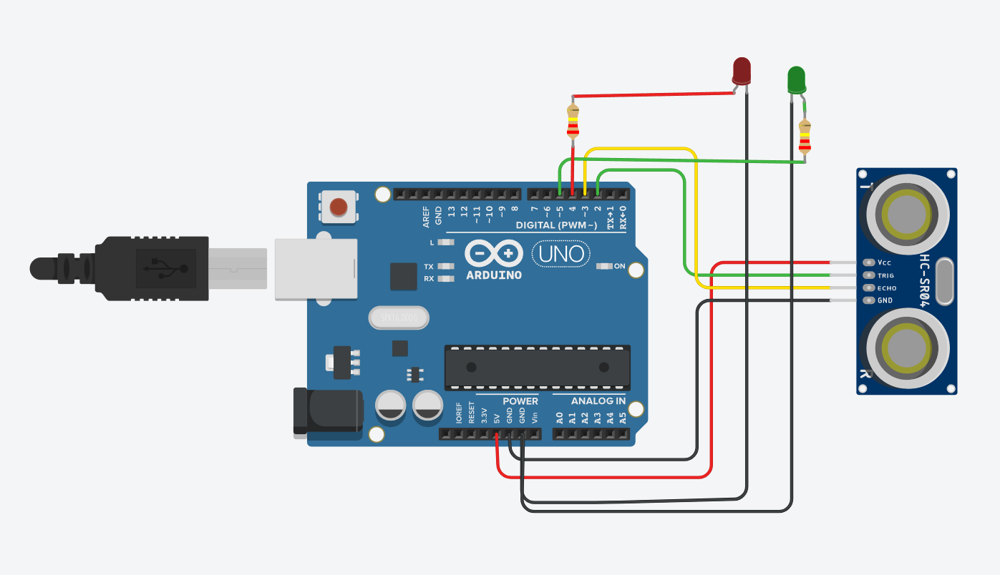
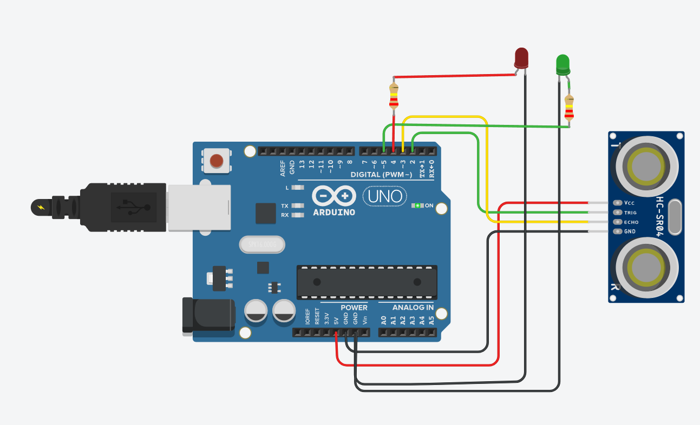
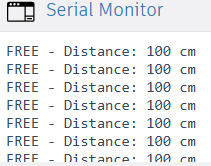

# 🚗 Smart Parking System – Arduino UNO

An embedded C application for **automatic parking space detection** using ultrasonic sensors and LED indicators, developed and simulated on Arduino UNO.

---

## 📸 Demo

### Circuit – FREE (Loc Liber)


### Circuit – OCCUPIED (Loc Ocupat)


### Serial Monitor Output


---

## 📋 Description

This project simulates a **real-time smart parking lot system** where each parking space is monitored by an **HC-SR04 ultrasonic sensor**. Based on the measured distance to the nearest object (vehicle), the system:

- 🟢 Turns on **GREEN LED** → Space is **FREE**
- 🔴 Turns on **RED LED** → Space is **OCCUPIED**
- 📡 Outputs real-time distance and status via **Serial Monitor**

The system uses the **time-of-flight principle**: the sensor emits an ultrasonic pulse and measures the time it takes to bounce back, calculating the distance to the nearest object. If the distance is below **20 cm**, the space is considered occupied.

---

## 🛠️ Hardware Components

| Component | Quantity | Purpose |
|-----------|----------|---------|
| Arduino UNO | 1x | Microcontroller |
| HC-SR04 Ultrasonic Sensor | 1x | Distance measurement |
| LED Red | 1x | Occupied indicator |
| LED Green | 1x | Free indicator |
| Resistor 220Ω | 2x | LED current protection |
| Breadboard | 1x | Circuit connections |
| Jumper Wires | - | Connections |

---

## 📌 Pin Configuration

```
HC-SR04 Sensor:
  VCC  → 5V  (Red wire)
  GND  → GND (Black wire)
  TRIG → Pin 2 (Green wire)
  ECHO → Pin 3 (Yellow wire)

LED Red (Occupied):
  Anode (+) → 220Ω Resistor → Pin 4
  Cathode (-) → GND

LED Green (Free):
  Anode (+) → 220Ω Resistor → Pin 5
  Cathode (-) → GND
```

---

## ⚙️ How It Works

```
1. setup()
   - Initializes Serial Communication (9600 baud)
   - Sets pin modes (OUTPUT/INPUT)
   - Sets default state: GREEN LED ON (space free)

2. loop() [runs every 500ms]
   - Calls measureDistance()
   - If distance < 20cm → RED LED ON, GREEN OFF (OCCUPIED)
   - If distance ≥ 20cm → GREEN LED ON, RED OFF (FREE)
   - Prints status to Serial Monitor

3. measureDistance()
   - Sends 10μs ultrasonic pulse via TRIG pin
   - Measures echo duration via ECHO pin (pulseIn)
   - Calculates: distance = duration × 0.0343 / 2
   - Returns distance in cm
```

---

## 💻 Code

```c
// SMART PARKING SYSTEM - Arduino UNO
const int TRIG = 2;
const int ECHO = 3;
const int LED_RED = 4;
const int LED_GREEN = 5;
const int DISTANCE_THRESHOLD = 20;

void setup() {
  Serial.begin(9600);
  Serial.println("\n=== SMART PARKING SYSTEM STARTED ===");
  Serial.println("Testing 1 Parking Space...\n");

  pinMode(TRIG, OUTPUT);
  pinMode(ECHO, INPUT);
  pinMode(LED_RED, OUTPUT);
  pinMode(LED_GREEN, OUTPUT);

  digitalWrite(LED_GREEN, HIGH);
  digitalWrite(LED_RED, LOW);

  delay(1000);
}

void loop() {
  int distance = measureDistance();

  if (distance < DISTANCE_THRESHOLD) {
    digitalWrite(LED_RED, HIGH);
    digitalWrite(LED_GREEN, LOW);
    Serial.print("OCCUPIED - Distance: ");
  } else {
    digitalWrite(LED_RED, LOW);
    digitalWrite(LED_GREEN, HIGH);
    Serial.print("FREE - Distance: ");
  }

  Serial.print(distance);
  Serial.println(" cm");

  delay(500);
}

int measureDistance() {
  digitalWrite(TRIG, LOW);
  delayMicroseconds(2);
  digitalWrite(TRIG, HIGH);
  delayMicroseconds(10);
  digitalWrite(TRIG, LOW);

  long duration = pulseIn(ECHO, HIGH, 30000);
  int distance = duration * 0.0343 / 2;

  if (distance == 0 || distance > 100) return 100;
  return distance;
}
```

---

## 📡 Serial Monitor Output

```
=== SMART PARKING SYSTEM STARTED ===
Testing 1 Parking Space...

FREE - Distance: 100 cm
FREE - Distance: 100 cm
OCCUPIED - Distance: 12 cm
OCCUPIED - Distance: 11 cm
FREE - Distance: 100 cm
```

---

## 🧪 Testing

The project was built and simulated using **TinkerCAD Circuits**:
- ✅ Compiled successfully (3428 bytes – 10% of program storage)
- ✅ GREEN LED lights up when space is free
- ✅ RED LED lights up when space is occupied
- ✅ Serial Monitor displays real-time distance readings
- ✅ Threshold detection works correctly at 20cm

---

## 🚀 Future Improvements

- [ ] Add 2nd and 3rd parking spaces (multiple HC-SR04 sensors)
- [ ] Add LCD display showing available spots count
- [ ] Add buzzer alert when all spots are occupied
- [ ] Implement RFID-based user authentication
- [ ] Web dashboard for remote monitoring

---

## 👨‍💻 Author

**Mijache Nicusor**
- 📧 nicumijache78@gmail.com
- 🎓 Computer Science Student – Faculty of Automation, Computers and Electronics, Craiova
- 📅 May 2026

---

## 📄 License

This project is open source and available under the [MIT License](LICENSE).
